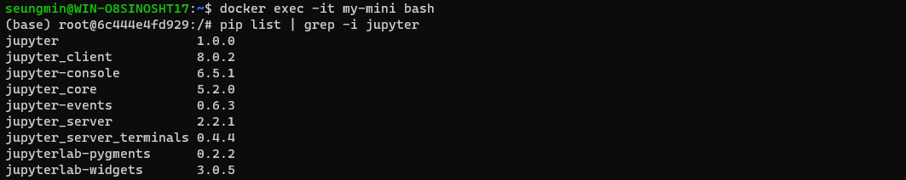
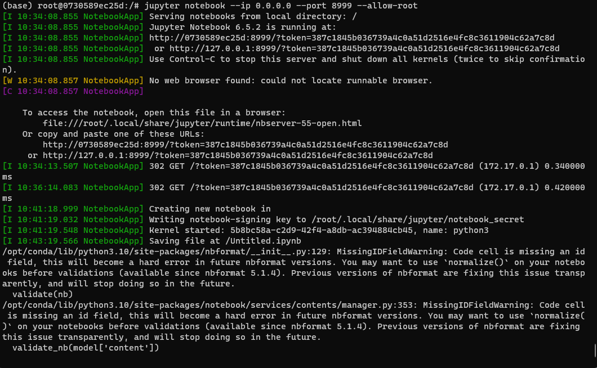
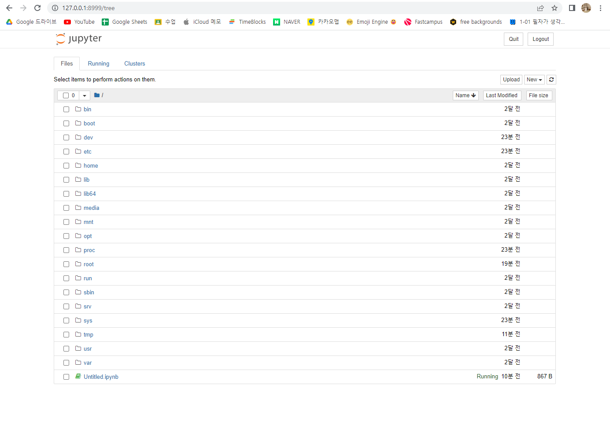
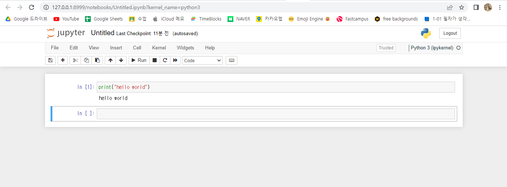

## 1. tensorflow 이미지를 가져와서 컨테이너 실행 후 디바이스 목록 확인하기
1-1. docker pull 명령어를 통한 이미지 가져오기  
docker pull tensorflow/tensorflow  
1-2. docker run 명령어를 통한 컨테이너 실행    
docker run -it --name hello_world3 tensorflow/ tensorflow:latest    
docker ps    
1-3. 컨테이너 접속 후 python 실행  
docker exec -it hello_world3 bash  
python -V  
python  
1-4. 아래 명령어를 통해서 디바이스 목록 확인  
from tensorflow.python.client import device_lib  
device_lib.list_local_devices()  

## 2. miniconda3  이미지를 가져와서 컨테이너 실행 후 pandas, numpy 설치 후 import 하기  
2-1. 이미지명 : continuumio/miniconda3  
2-2. docker pull 명령어를 통한 이미지 가져오기  
2-3. docker run 명령어를 통한 컨테이너 실행  
docker run -it --name my-mini continuumio/miniconda3:latest  
docker run -it --name mytf -p 8000:8888 continuumio/miniconda3:latest  
docker run -it --name mytf -p 127.0.0.1:8999:8999 continuumio/miniconda3:  
2-4. 컨테이너 접속 후 미니콘다 가상환경 실행 확인하기  
docker exec -it my-mini bash  
docker exec -it my-mini env  
2-5. pandas, numpy 버전 확인하기  
설치되어 있지 않으면 pip 통한 설치하기  
pip list | grep -i pandas  
pip install pandas  


## 3. 앞서 만든 (2번) 컨테이너에서 jupyter notebook 실행하기  
3-1. pip를 사용해 jupyter 패키지 설치하기  
pip install jupyter  
3-2. jupyter notebook 실행(관리자 권한 포함) 및 웹브라우저에서 접속하기 port 번호는 여러분 마음대로   
jupyter notebook --ip 0.0.0.0 --allow-root  
jupyter notebook --ip 0.0.0.0 --port 8999 --allow-root  

3-3. 노트북 파일 생성 후 코드 실행해보기  
  
  

## 4. Dockerfile 을 사용한 이미지 만들기  
- Dockerfile에 포함될 내용  
- 베이스 이미지는 python 3. x  
- apt-get update  
- apt-get upgrade -y  
- apt-get clean && apt-get autoremove -y  
- apt-get install -y python3-pip  
- workdir /data/app  


4-1. Docker 설치 패키지 만들기  
nano docker_install.sh  
cat docker_install.sh  
sh docker_install.sh or ./docker_install.sh  
exit  
4-2. Jupyter-img 세팅  
mkdir workspace  
cd workspace  
pwd  
nano Dockerfile  
nano requirements.txt  
docker build -t jupyter-img .  
docker images   
4-3. 컨테이너 만들기    
docker run -d -p 80:8888 -v $(pwd):/workspace --name jupyter-container -t jupyter-img  
docker ps  
docker logs jupyter-container  
4-4. Jupyter Server 접속  
Public IP 확인  

```
# docker_install.sh
#!/bin/bash

# basic update
sudo apt-get update -y && sudo apt upgrade -y


# install docker

curl -fsSL https://download.docker.com/linux/ubuntu/gpg | sudo apt-key add -

sudo add-apt-repository "deb [arch=amd64] https://download.docker.com/linux/ubuntu bionic stable"

sudo apt update -y

apt-cache policy docker-ce

sudo apt install -y docker-ce

sudo usermod -aG docker $USER
```
```
# Dockerfile
FROM python:3.8
WORKDIR /workspace
COPY . /workspace
RUN python -m pip install --upgrade pip
RUN pip install -r requirements.txt
ENTRYPOINT ["jupyter"]
EXPOSE 8888
CMD ["notebook", "--ip", "0.0.0.0", "--port", "8888", "--allow-root", "--NotebookApp.token='password'"]
```
```
# requirements.txt
jupyter
pandas
numpy
```
---
```
$ cat /etc/passwd
계정확인

$ clear
$ sudo adduser username
새 계정 만들기

$ docker -v
버전 확인

$ docker create [image]
docker create nginx - 같은 이름의 이미지가 없을 경우 자동으로 생성됨 (create / run) 모두

$ docker ps -a
만든 contatiner 확인 / NAMES 랜덤 지정

$ docker ps
실행되고 있는 container만 나옴

$ docker images
REPOSITORY / TAG / IMAGE ID / CREATED / SIZE

$ clear
지우기

$ docker run [image]
image 실행
$ Ctrl + c
프로세스 종료

$ docker run \
-i \
-t \
--rm \
-d \
--name hello-world \
-p 80:80 \
-v /opt/example:/example \
fastcampus/hello-world:latest \
my-command

$ docker run ubuntu:latest

$ docker run -it ubuntu:latest
컨트롤러 내부에 들어옴 ls - 
bin  boot  dev  etc  home  lib  lib32  lib64 ~~r

$ Ctrl + p, q
죽이지 않고 나옴

$ docker run -d nginx
백그라운드로 실행

$ docker run -d --name [NAMES] [IMAGE]:[TAGGING NAME]
docker run -d --name my-nginx nginx:latest - 이름 변경

$ docker run -p 80:80 -d nginx:latest
포트 지정

$ curl localhost:80
페이지 html 형식

$ curl https://www.naver.com
api 작동 확인

$ docker run --rm ubuntu:latest id
uid=0(root) gid=0(root) groups=0(root) - option(rm) 주기
docker ps -a 로 확인해보면 확인 가능

$ bash (powershell에서 Linux로 접근)
$ su hwkim
root에서 계정 변경

$ docker stop [container]
순차적인 종료

$ docker kill [image]

$ docker stop $(docker ps -a -q)
모든 종료

$ docker rm [container]
Container 삭제. 실행중인 컨테이너는 삭제불가

$ docker rm -f [container]


엔트리포인트(Entrypoint)
도커 컨테이너가 실행할 때 고정적으로 실행되는 스크립트 혹은 명령어
생략될 수 있으며, 생략될 경우 커멘드에 지정된 명령어로 수행

커맨드(Command)
도커 컨테이너가 실행할 때 수행할 명령어 혹은 엔트리포인트에 지정된 명령어에 대한 인자 값
단독적으로 사용할 때는 컨테이너가 실행할 명령어가 됨

$ docker run --entrypoint sh ubuntu:latest
컨테이너 실행 시 bash 대신 sh 실행

$ docker run --entrypoint python python:3.8-alpine --version
dockerfile의 entrypoint 설정 덮어쓰기

$ docker run --entrypoint echo ubuntu:latest hello world
컨테이너 실행 시 echo hello world 실행

$ docker run -it -e MY_HOST=1.1.1.1 ubuntu:latest bash
echo $MY_HOST
env

$ pwd
현재 경로

$ docker exec [container] [command]

$ docker exec -it mynginx env
컨테이너 환경

$ docker exec -it mynginx bash
컨테이너 배시 접속
# ls -l /etc/nginx
total 32
파일 검색


$ docker run -p [HOST IP:PORT] : [COMTAINER PORT] [container]
컨테이너의 포트를 호스트의 ip:port와 연결하여 서비스를 노출합니다

$ docker run -p 8080:80 nginx:latest
localhost:8080 - 주소
curl localhost:8080

$ docker run -d --expose 90 nginx
expose 옵션은 그저 문서화 용도

$ docker run -d -p 80 nginx
publish 옵션은 실제 포트를 바인딩

$ docker run -d -p 9090:80 --name my-nginx4 -v $(pwd):/usr/shar
e/nginx/html nginx:latest

$ docker volume create --name db
볼륨 기능을 이용하여

$ docker run -d --name my-sql -e MYSQL_DATABASE=mydb -e MYSQL_R
OOT_PASSWORD=password -v db:/var/lib/mysql -p 3306:3306 mysql:5.7

$ docker logs [NAEMS]
로그출력

$ docker logs -tail 10 [NAMES]
10개 짜르기

$ docker logs -f [NAMES]
실시간 로그

$ docker logs -f -t [NAMES]
타임 스탬프 출력

$ docker run -it --name my-ubuntu ubuntu:latest
# cat > my-file
12345
^C

$ docker commit -a smki -m "Add my file" my-ubuntu my-ubuntu:v1 0.0
$ docker images

$ docker images --format "{{json .}}"
$ docker images my-ubuntu --format "{{json .}}"

$ docker build -t my-app:v1.0.0 ./
vim Dockerfile

$ docker run -it -d -p 8081:80 --name nodejs-server nodejs-serv
er bash
denied 관련 에러남

$ docker rmi 7a34cbec2c3f
tagging

$ docker load -i [INPUT-FILE]
ubuntu_focal.tar 압축 파일에서 ubuntu:focal 이미지 불러오기
$ docker save -o ubuntu_focal.tar ubuntu:focal

$ docker login -u seungminki

$ docker pull postgres
이미지 다운

$ docker exec -it hello_world3 bash
bash로 접속

$ docker container start my-mini
꺼져있을 때

```
---
1. 서버와 연결한 후 Ctrl + C + y 가 아닌 Ctrl + Z 로 나오게 되면 포트번호가 안끊어져서 해당 포트번호로 다시 연결이 안되는 문제점이 있으나, 아직 해결방안 찾지 못함
포트번호를 끊는 방법이나 다시 접속하는 방법을 알아봐야 할 듯?

2. 컨테이너를 대량으로 만들 경우 서로 꼬여서 서버가 실행되지 않는 문제
docker rm $(docker ps -a -q) 으로 모두 지우고 진행하니 해결.

3. docker run -it --rm --name mytf -p 8000:8888 continuumio/miniconda3:latest
rm이 포함되어 있을 경우 stop 하였을 때 컨테이너가 날아감
