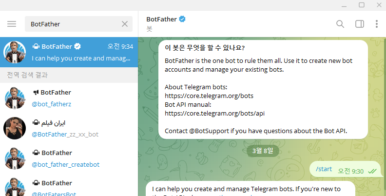
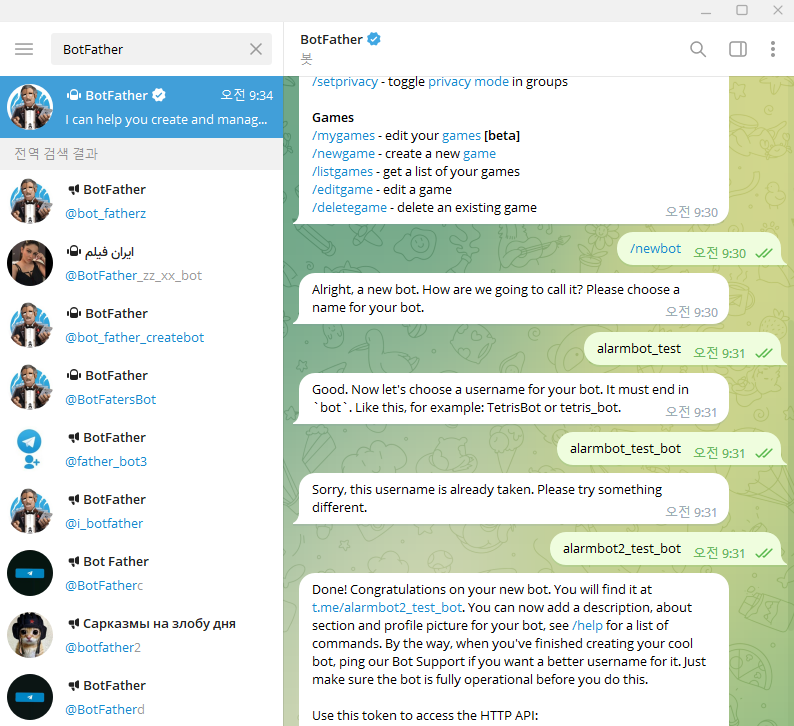
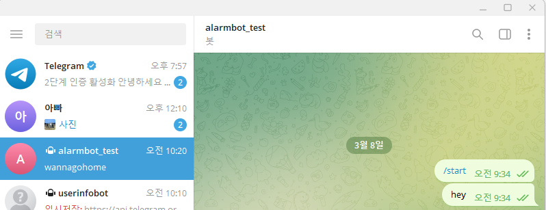
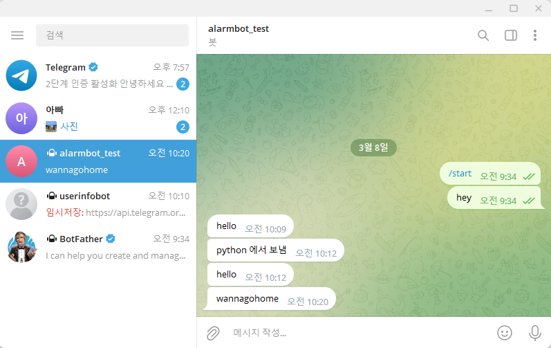

## AWS Lambda로 오류날때마다 텔레그램으로 메시지 보내기

텔레그램에서 @BotFather라는 봇을 검색한다  
@start 명령어를 입력하면 여러가지 기능을 설명해준다  
  


@newbot 명령어를 입력하면 새로운 봇을 만들 수 있다  
bot이 잘 생성되면 HTTP API token이 생성된다  
  

https://api.telegram.org/bot{token}/getUpdates  
chat_id를 알기 위해 위 사이트에 접속한다  
  

@start 를 쳐서 봇을 활성화 시킨 다음 아무말이나 보내면  
chat_id가 보일 것이다  
  

https://api.telegram.org/bot{token}/sendMessage?chat_id={id}&text=wannagohome  
text= 부분에 텍스트를 넣어서 입력하면 이렇게 채팅이 온다  
  

Lambda 함수 생성
* 블루프린트: 다른 사람들이 구현해 놓은 여러가지 기능의 람다 함수들(~=템플릿)
* 런타임: Python 3.9
* 구성 > 환경변수: TOKEN = '~'
* Deploy: 코드 완성 및 수정 후 눌러줘야 반영됨
* Test: 동작 테스트
```Python
import http.client
import json
import os

def lambda_handler(event, context):

  TELEGRAM_API_HOST = 'api.telegram.org'
  TOKEN = os.environ['TOKEN']
  chat_id = '6215433414'

  connection = http.client.HTTPSConnection(TELEGRAM_API_HOST)

  url = f"/bot{TOKEN}/sendMessage"

  headers = {'content-type': "application/json"}
  param = {'chat_id': chat_id, 'text': 'Check this server'}

  connection.request("POST", url, json.dumps(param), headers)

  req_response = connection.getresponse()

  print(json.dumps(json.loads(req_response.read().decode()), indent=4))
  print(f'Response Message: [{req_response.status}] {req_response.msg}')

  connection.close()
  
  return {
    'statusCode': 200,
    'body': json.dumps('Succeeded sending message ...')
    }
```
API Gateway 만들기
* 트리거 추가: Lambda 이벤트를 발생시킬 수 있는 AWS 리소스들
* API Gateway > HTTP API (보안: 열기)
* API Gateway 엔드포인트 호출 시 Lambda 가 실행되고 Telegram 알람이 전송됨

서버에서 API Gateway 호출
* curl 을 사용하여 호출 가능
* 현재는 아무런 데이터도 넘기지 않고 호출만 하는 형태지만
* --data ‘{“message”: {“node”: “192.168.50.11”, “text”: “Check Server”}}’ 등등 정보 함께
POST 해서 Lambda 에서 event 함수 인자로 응용이 가능함
* 쉘 하나를 만들어서(ex.run.sh) 아래처럼 사용할 수도 있음
```Python
flask run.py || (curl "http_telegrambot") # 앞에 수행한 파이썬이 비정상 종료되었을 때만 호출
flask run.py && (curl "http_telegrambot") # 앞에 수행한 파이썬이 정상 종료되었을 때만 호출
flask run.py | (curl "http_telegrambot") # 앞에 수행한 파이썬이 어찌됬든 끝나면 호출
```
python-telegram-bot 설치
```Python
pip install python-telegram-bot
```
봇에 메시지 보내기
```Python
import telegram

token = "토큰"
bot = telegram.Bot(token)
bot.sendMessage(chat_id= 사용자아이디, text= "안녕하세요 저는 봇입니다.")
```
파이썬 텔레그램 봇 써서 알람 보낼수도 있다
